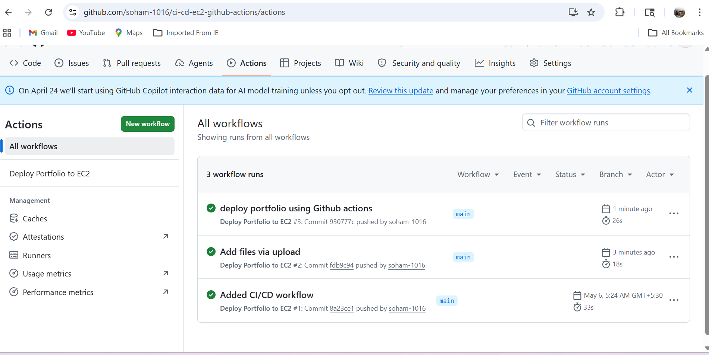
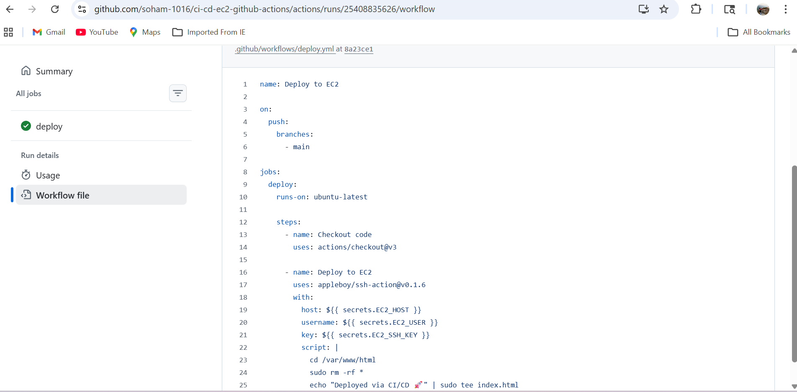
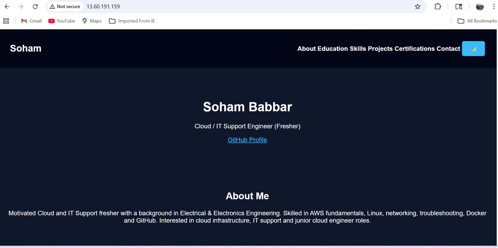
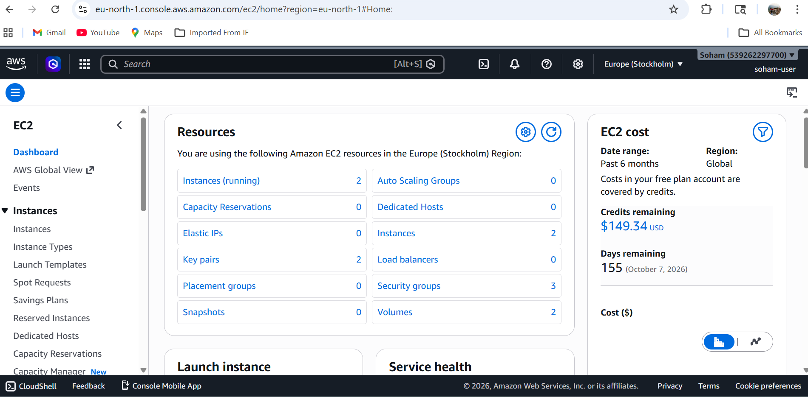
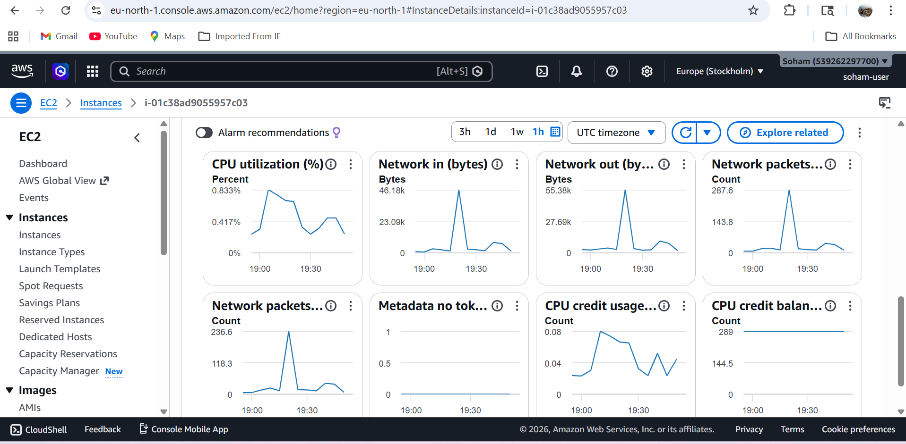

# ci-cd-ec2-github-actions
CI/CD pipeline using GitHub Actions to deploy applications on AWS EC2 with CloudWatch monitoring.
## 📸 Screenshots

### GitHub Actions Success

### Workflow File

### EC2 Portfolio Output

### EC2 Instance Running

### CloudWatch Monitoring

